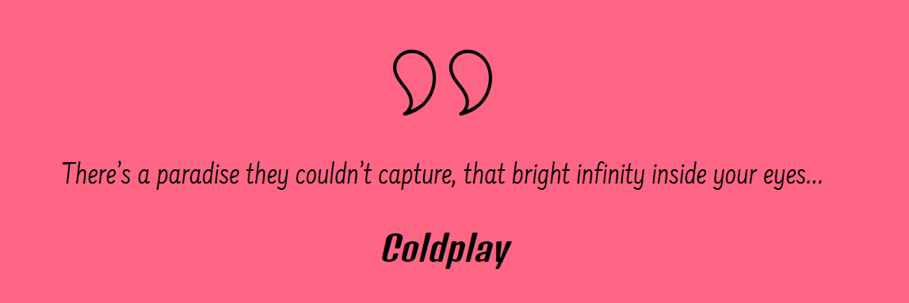
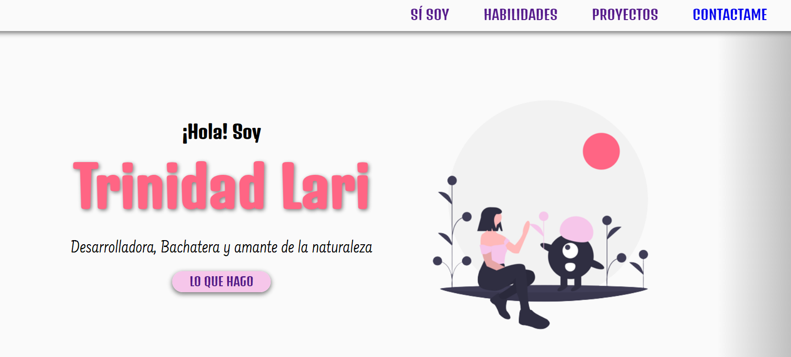
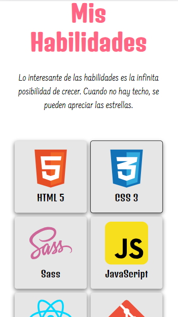
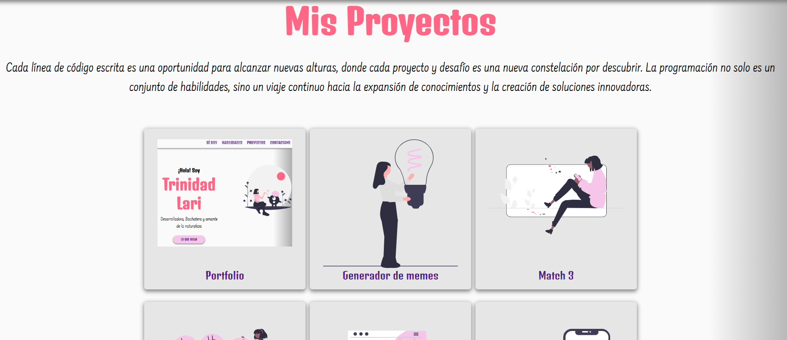
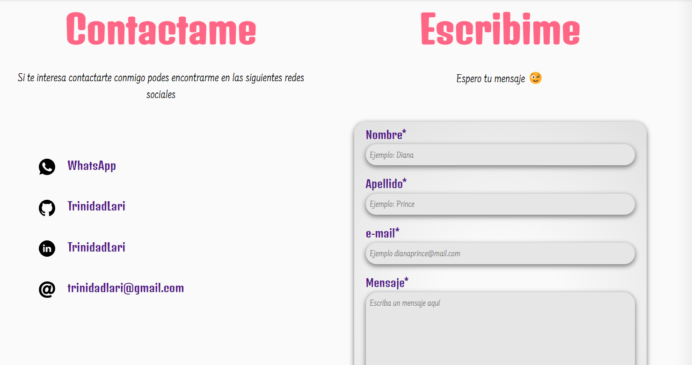
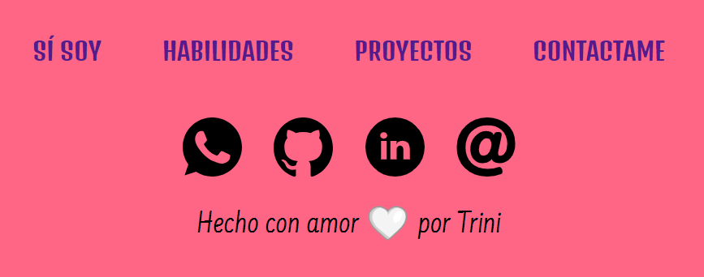

# Portfolio de Trinidad Lari
Bienvenido a mi portfolio, donde puedes conocer más sobre mí, mis habilidades y los proyectos que he realizado.

## Secciones Principales

### Presentación:
Una breve introducción sobre quién soy y cuáles son mis intereses.

### Mis Habilidades:
Una lista de las habilidades y tecnologías que poseo.
- HTML
- CSS
- SASS
- JAVASCRIPT
- REACT
- GIT

### Mis Proyectos:
Descripciones y enlaces a los proyectos que he realizado. 
- Portfolio
- Generador de memes
- Match 3
- Controlador de gastos
- Administrador de reuniones
- Todo App
- Buscador de películas

### Contacto:
Información de contacto para que las personas puedan comunicarse conmigo.

## Estado del Proyecto
El portfolio está actualmente en desarrollo activo. Estoy trabajando constantemente para mejorar y agregar más contenido.

## Licencia
Este portfolio es propiedad de **Trinidad Lari** y está bajo su nombre. Todos los derechos reservados. 
[Mi Portfolio][def]  

❤️❤️❤️❤️❤️❤️❤️❤️❤️❤️❤️❤️❤️❤️❤️❤️❤️❤️❤️❤️❤️ 

 

[def]: https://github.com/TrinidadLari/Portfolio

